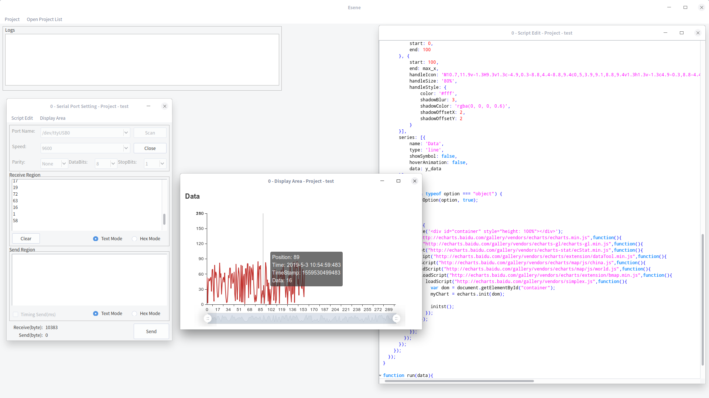

# Esene-Gambas3 For Linux 1.0.5
[Windows Version](https://github.com/imxcstar/Esene "Windows Version")
## Development Language Gambas3
install

sudo apt install gambas3-runtime gambas3-gb-form gambas3-gb-image gambas3-gb-qt4 gambas3-gb-qt4-ext gambas3-gb-qt4-webkit gambas3-gb-web gambas3-gb-form-stock gambas3-gb-net gambas3-gb-util-web gambas3-gb-eval-highlight

